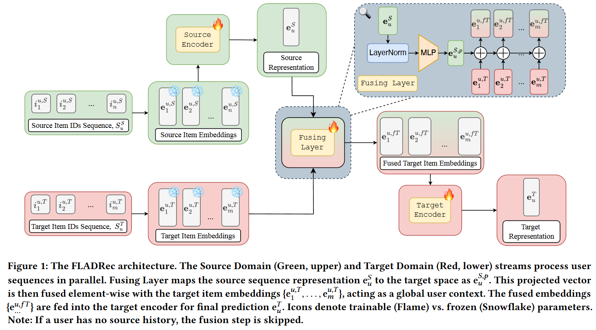

# FLADRec: Federated Adaptation for Cross-Domain Sequential Recommendation


This repository contains the official implementation of the paper **FLADRec: Federated Adaptation for Cross-Domain Sequential Recommendation**. 
This work proposes a simple and practical framework for cross-domain sequential recommendations that transfers information exclusively through learned user representations, without sharing raw interaction data or item embeddings across domains.



## Table of Contents
- [Installation](#installation)
- [Preparing Your Data and Config](#preparing-your-data-and-config)
- [Running a Single Experiment](#running-a-single-experiment)
- [Tuning Your Config](#tuning-your-config)
- [Evaluation Setups](#evaluation-setups)
- [Abstract](#abstract)

## Installation

### Preparing the environment
To get started, create a conda environment and install the required packages.

```bash
conda create -n fladrec_env python=3.11  
conda activate fladrec_env   
pip install -e . 
```

## Preparing Your Data and Config

The framework expects a specific structure for data and configuration files to run experiments smoothly.

### Data Structure
Your data should be organized in the following file tree structure. Each domain has its own directory containing `train`, `validation`, and `test` splits in `.parquet` format.

```
data/
└── <domain_name>/
    ├── train.parquet
    ├── val.parquet
    ├── test.parquet
    └── item_id_to_idx.pkl
```

The `.parquet` files for `train`, `val`, and `test` must contain the following columns:
- `uid`: `int64` - User identifier. Users shared across domains must have the same `uid`.
- `item_id`: `int64` - Item identifier, indexed from 1 to the number of items in that domain.
- `timestamp`: `int64` - Interaction timestamp.

Data can be split using strategies like "leave-last-out" or based on a global timestamp.

### Config Structure
Each domain requires a configuration file located in `config/domain/`. This file specifies model hyperparameters, data paths, and other settings.

Example: `config/domain/Movie.yaml`
```yaml
name: Movie
path: data/amb/Movie
max_seq_len: 50
hp:
  embedding_dim: 256
  num_heads: 4
  num_layers: 1
  learning_rate: 3e-4
  dropout: 0.2
```

For domain adaptation experiments (transfers), a corresponding config file is needed in `config/transfer/`. This file defines the source and target domains and the adaptation-specific hyperparameters.

Example: `config/transfer/Movie2Book.yaml`
```yaml
name: Movie2Book
hp:
  dropout: 0.04
  proj_hidden_dim: 768
  proj_num_layers: 2
  normalize_cd: true
  learning_rate_src: 4e-5
  learning_rate_tgt: 3e-4
  learning_rate_fuse: 3e-3
```

## Running a Single Experiment

Experiments are run in a two-step process.

### 1. Pre-training
First, run `pretrain.py` to train the in-domain models for both the source and target domains. This step saves the pretrained model checkpoints.

For example, to pretrain the 'Movie' domain model:
```bash
python scripts/pretrain.py domain=Movie
```

### 2. Adaptation
Once you have the pretrained models, run `adapt.py` to train the adapter for a specific transfer task.

- Use `phase=train` to train the adapter.
- Use `phase=test` to evaluate the model on the test set.

For example, to train and then test a transfer from 'Movie' to 'Book':
```bash
# Training phase
python scripts/adapt.py transfer=Movie2Book phase=train

# Testing phase
python scripts/adapt.py transfer=Movie2Book phase=test
```

## Tuning Your Config

You can optimize hyperparameters for both pre-training and adaptation using the scripts in the `/tuning` directory. These scripts use Optuna for hyperparameter search.

- `tune_pretrain.py`: Tunes a single-domain model.
- `tune_adapt.py`: Tunes a transfer (adapter) setup.

When a tuning script completes, it will automatically update the original `.yaml` configuration file with the best-found hyperparameters. Note that all tuning is performed using the training split (`phase=train`).

```bash
# Tune a single-domain model
python tuning/tune_pretrain.py domain=Book

# Tune an adaptation model
python tuning/tune_adapt.py transfer=Movie2Book
```

## Evaluation Setups

We provide two standard evaluation setups, configured in `/config/eval_setup`.

1.  **Benchmark (`benchmark.yaml`)**: This is the standard evaluation protocol. The model is tasked with ranking the ground-truth next item against a set of 999 randomly sampled negative items. The primary metric is `ndcg@10`. This setup measures performance in a typical recommendation scenario.

2.  **Scalability (`scalability.yaml`)**: This setup is designed to test the model's performance and efficiency at scale. The model ranks the ground-truth next item against *all* other items in the catalog. The primary metric is `ndcg@100`. This is a more challenging, full-catalog ranking task that evaluates how well the model can discriminate among a vast number of candidates.

You can specify the evaluation setup to use via the command line when running adaptation.

## Abstract

Cross-domain sequential recommendation aims to improve next-item prediction in a target domain by leveraging user behavior from auxiliary source domains. However, real-world deployment faces two critical challenges: strict privacy or business constraints that isolate interaction data across domains, and user heterogeneity, where many users lack cross-domain activity. This makes existing cross-domain methods difficult to apply. In this paper, we propose a simple and practical framework for cross-domain sequential recommendations that transfers information exclusively through learned user representations, without sharing raw interaction data or item embeddings across domains. We introduce a lightweight adapter that projects the source-domain user representation into the target-domain embedding space and integrates it with the target interaction sequence. Importantly, when source data is unavailable (i.e., user observed only in the target domain), the model seamlessly defaults to a robust target-only sequential recommender, retaining benefits from joint training across all users. Extensive experiments on multiple benchmarks demonstrate consistent improvements over strong baselines for both shared and unshared users.

